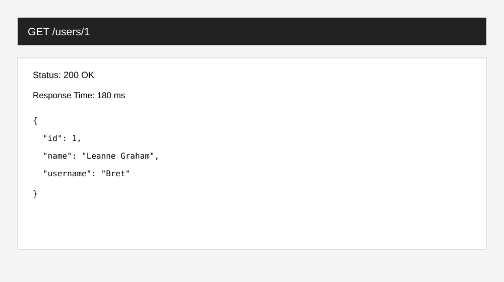
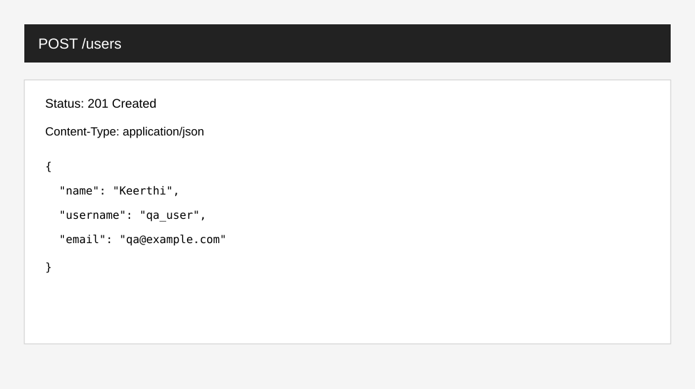
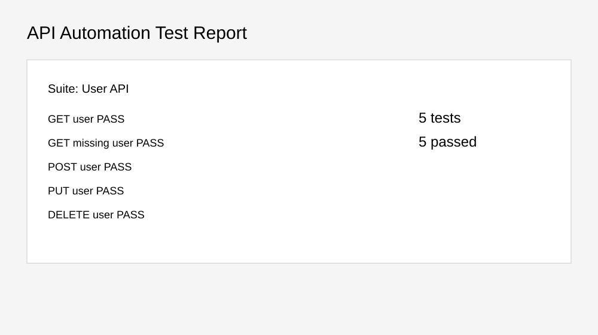

# 🔗 API Automation using Rest Assured

A Java + Maven API automation framework using **REST Assured** and **JUnit 5**. The project demonstrates reusable API test setup, request/response validation, CRUD automation, JSON assertions and negative testing.

## Tech Stack
- Java 17+
- Maven
- REST Assured
- JUnit 5
- Hamcrest
- JSONPlaceholder public demo API

## Project Structure
```text
API-Automation-Rest-Assured/
├── README.md
├── pom.xml
├── src/test/java/api/
│   ├── BaseApiTest.java
│   └── UserApiTest.java
├── src/test/resources/
│   └── config.properties
├── Test-Data/api_test_data.csv
└── Screenshots/
    ├── get-user-response.svg
    ├── post-user-response.svg
    └── test-report.svg
```

## Test Coverage
| Test | Coverage |
|---|---|
| GET user | Status, response time, JSON field |
| GET missing user | 404 negative validation |
| POST user | 201 status and response body |
| PUT user | 200 status and updated field |
| DELETE user | 200 status |

## Run
```bash
mvn clean test
```

## Screenshots






> Screenshots are portfolio documentation mockups illustrating expected API-test evidence; they are not claimed as live execution output.

## Author
**Keerthi Kandula** — Aspiring QA Engineer / Software Tester
